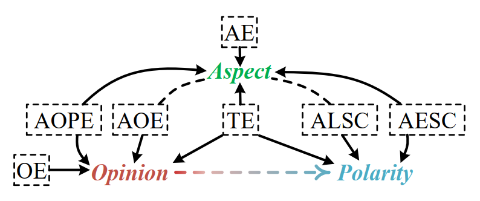
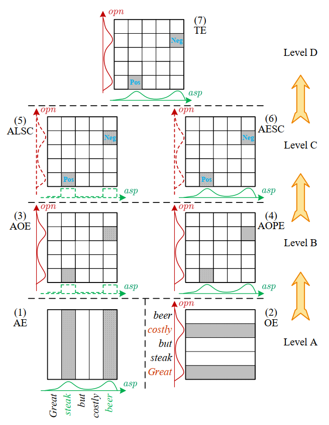
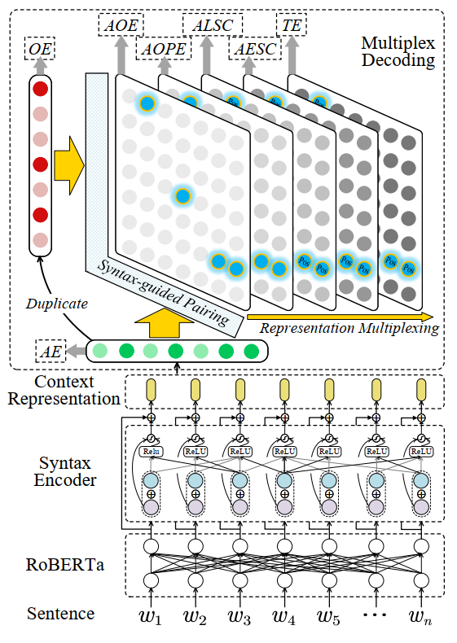

Resources for IJCAI2022 paper: [Inheriting the Wisdom of Predecessors: A Multiplex Cascade Framework for Unified Aspect-based Sentiment Analysis
](https://www.ijcai.org/proceedings/2022/0572.pdf)

----

## Seven subtasks of ABSA by unification:

In ABSA community there are at least following seven representative subtasks:

```
  AE: aspect term extraction;
  OE: opinion term extraction;
  AOE: aspect-oriented opinion extraction;
  AOPE: aspect-opinion pair extraction;
  ALSC: aspect-level sentiment classification;
  AESC: aspect extraction and sentiment classification;
  TE: triplet extraction

```

All these subtasks are related by revolving around the predictions of three elements: <aspect, opinion, polarity>.


<p align="center">
  
</p>

In this project, we consider the unfied ABSA.
We try to enhance the ABSA subtasks by making full use of the interactions between all subtasks, with a **multiplex cascade** framework.


----

## Re-ensembled data for unified ABSA

* Wang et al. (2017) [1] annotate the unpaired opinion terms (denoted as D_17), 
* Fan et al. (2019) [2] pair the aspects with opinion terms (D_19), 
* Peng et al. (2020) [3] further provide the labels for triple extraction (D_20). 


To enable multi-task training, we re-ensemble the existing ABSA datasets so that most of the sentences’ annotations cover all seven subtasks. 


[1] Coupled Multi-Layer Attentions for Co-Extraction of Aspect and Opinion Terms. In AAAI. 2017.

[2] Target-oriented Opinion Words Extraction with Target-fused Neural Sequence Labeling. In NAACL. 2019.

[3] Knowing What, How and Why: A Near Complete Solution for Aspect-Based Sentiment Analysis. In AAAI. 2020.


----

## Multiplex Cascade Framework.


The schematic of hierarchical dependency (HD):

<p align="center">
  
</p>


The multiplex cascade framework:

<p align="center">
  
</p>


----


## Environments


```
- python (3.8.12)
- cuda (11.4)
- numpy (1.21.4)
- torch (1.10.0)
- gensim (4.1.2)
- transformers (4.13.0)
- pandas (1.3.4)
- scikit-learn (1.0.1)
- corenlp (4.2)
```


----


## Usage 

### Preprocessing

First parse out the dependency trees and POS tags for each sentence, and save as json format.
Recommend employ the stanfordnlp [CoreNLP](https://stanfordnlp.github.io/CoreNLP/) tool.
And use the NLTK package to wrap the parsing process.

Download the `RoBERTa` PLM.

### Configuration

Configure the `configs\train.conf` and `configs\eval.conf` files.

### Running

```
  python main.py
```

----
If you use this work or code, please kindly cite:


```
@inproceedings{fei2022unifiedABSA,
  author    = {Hao Fei and Fei Li and Chenliang Li and Shengqiong Wu and Jingye Li and Donghong Ji},
  title     = {Inheriting the Wisdom of Predecessors: A Multiplex Cascade Framework for Unified Aspect-based Sentiment Analysis},
  booktitle = {Proceedings of the Thirty-First International Joint Conference on Artificial Intelligence, {IJCAI}},
  pages     = {4121--4128},
  year      = {2022},
}